# 🛑 Hardstop

**The Emergency Brake for Claude Code, Claude Desktop & Cowork.**

Hardstop is a defense-in-depth safety layer that catches dangerous commands and credential file reads before they execute: even when soft guardrails fail.

  

[Installation](#-installation) • [How It Works](#%EF%B8%8F-how-it-works) • [Commands](#%EF%B8%8F-controls) • [Report Issue](https://github.com/frmoretto/hardstop/issues)

---

## ⚡️ Why Hardstop?

You trust your AI, but you shouldn't trust it with `rm -rf /` or reading your `~/.aws/credentials`. Hardstop sits between the LLM and your system, enforcing a strict **Fail-Closed** policy on dangerous operations.

- **🛡️ Pattern Matching:** Instant regex-based detection for known threats (fork bombs, reverse shells)
- **🧠 LLM Analysis:** Semantic analysis for edge cases and obfuscated attacks
- **⛓️ Chain Awareness:** Scans every link in a command chain (`&&`, `|`, `;`)
- **🔐 Secrets Protection:** Blocks reading of credential files (`.ssh`, `.aws`, `.env`) *(v1.3)*
- **📚 LLM Guidance:** Teaches Claude how to think about safety, not just blocks

---

## 🚀 Quick Demo

Claude tries to ruin your day? **Hardstop says no.**

```bash
# Claude attempts a home directory deletion
$ rm -rf ~/
🛑 BLOCKED: Deletes home directory

# Claude tries to read your AWS credentials
$ Read ~/.aws/credentials
🛑 BLOCKED: AWS credentials file

# You check the status
$ /hs status
Hardstop v1.3.3
  Status:      🟢 Enabled
  Fail mode:   Fail-closed

# One-time bypass for a command you trust
$ /hs skip
⏭️  Next command will skip safety check

# Multi-skip: bypass next 3 commands (v1.3.2)
$ /hs skip 3
⏭️  Next 3 commands will skip safety check

# View recent security decisions
$ /hs log
2026-01-20 10:30:45 🛑 [pattern] rm -rf ~/
                     └─ Deletes home directory
```

---

## ⚙️ How It Works

Hardstop uses a two-layer verification system for Bash commands and pattern-based protection for file reads.

```mermaid
graph TD
    A[Tool Call] --> B{Bash or Read?};
    B -- Bash --> C{Layer 1: Patterns};
    C -- Dangerous Pattern --> D[🛑 BLOCK];
    C -- Safe Pattern --> E[✅ ALLOW];
    C -- Unknown --> F{Layer 2: LLM Analysis};
    F -- Risky --> D;
    F -- Safe --> E;
    B -- Read --> G{Credential File?};
    G -- .ssh/.aws/.env --> D;
    G -- Source Code --> E;
    D --> H[Log to Audit];
    E --> I[Execute];
```



---

## 📦 Installation

### macOS / Linux

```bash
git clone https://github.com/frmoretto/hardstop.git && cd hardstop && ./install.sh
```

### Windows

```powershell
git clone https://github.com/frmoretto/hardstop.git
cd hardstop
powershell -ExecutionPolicy Bypass -File install.ps1
```

### Verify

**Restart Claude Code / Desktop / Cowork**, then:

```
/hs status
```

### Uninstall

**macOS / Linux:**
```bash
cd hardstop && ./uninstall.sh
```

**Windows:**
```powershell
cd hardstop
powershell -ExecutionPolicy Bypass -File uninstall.ps1
```

The uninstaller removes plugin files, skills, and hooks from settings. State/audit logs are optionally preserved.

---

## 🕹️ Controls

Control Hardstop directly from the chat prompt.

| Command | Action |
|---------|--------|
| `/hs on` | Enable protection (Default) |
| `/hs off` | Disable temporarily |
| `/hs skip` | Bypass checks for the next command |
| `/hs skip [n]` | Bypass checks for the next n commands *(v1.3.2)* |
| `/hs status` | Check system health |
| `/hs log` | View recent security decisions |

---

## 🛡️ Protection Scope

<details>
<summary><strong>🐧 Unix (macOS/Linux) Bash Triggers</strong></summary>

- **Annihilation:** `rm -rf ~/`, `rm -rf /`, `mkfs`, `shred`
- **Malware:** Fork bombs, Reverse shells (`/dev/tcp`, `nc -e`)
- **Theft:** Exfiltration via `curl`/`wget` of `.ssh`, `.aws` credentials
- **Trickery:** Encoded payloads, Pipe-to-shell (`curl | bash`)
- **System damage:** `chmod 777 /`, recursive permission changes
- **Dangerous sudo:** `sudo rm -rf /`, `sudo dd`
- **Cloud CLI:** AWS, GCP, Firebase, Kubernetes destructive commands
- **Database CLI:** Redis FLUSHALL, MongoDB dropDatabase, PostgreSQL dropdb

</details>

<details>
<summary><strong>🪟 Windows Bash Triggers</strong></summary>

- **Destruction:** `rd /s /q`, `format C:`, `bcdedit /delete`
- **Registry:** `reg delete HKLM`, Persistence via Run keys
- **Credential theft:** `mimikatz`, `cmdkey /list`, SAM database access
- **Download cradles:** PowerShell IEX, `certutil`, `bitsadmin`, `mshta`
- **Encoded payloads:** `powershell -e <base64>`
- **Privilege escalation:** `net user /add`, `net localgroup administrators`

</details>

<details>
<summary><strong>🔐 Read Tool Triggers (v1.3)</strong></summary>

**Blocked (Credentials):**
- SSH keys: `~/.ssh/id_rsa`, `~/.ssh/id_ed25519`
- Cloud credentials: `~/.aws/credentials`, `~/.config/gcloud/credentials.db`
- Environment files: `.env`, `.env.local`, `.env.production`
- Docker/Kubernetes: `~/.docker/config.json`, `~/.kube/config`
- Package managers: `~/.npmrc`, `~/.pypirc`

**Allowed (Safe):**
- Source code: `.py`, `.js`, `.ts`, `.go`, `.rs`
- Documentation: `README.md`, `CHANGELOG.md`, `LICENSE`
- Config templates: `.env.example`, `.env.template`

</details>

---

## 📋 Audit Logging

All decisions are logged to `~/.hardstop/audit.log` in JSON-lines format:

```json
{"timestamp": "2026-01-20T10:30:45", "version": "1.3.0", "command": "rm -rf ~/", "cwd": "/home/user", "verdict": "BLOCK", "reason": "Deletes home directory", "layer": "pattern"}
```

View recent entries with `/hs log`.

---

## 📁 State Files

| File | Purpose |
|------|---------|
| `~/.hardstop/state.json` | Enabled/disabled state |
| `~/.hardstop/skip_next` | One-time bypass flag |
| `~/.hardstop/audit.log` | Decision audit log |

---

## 📚 Skill-Only Mode (Claude.ai / Desktop Projects)

For Claude.ai Projects or Claude Desktop without hook support, use the **SKILL.md** file directly:

1. Copy [`skills/hardstop/SKILL.md`](skills/hardstop/SKILL.md) to your Project's knowledge base
2. The skill provides LLM-level safety awareness (soft guardrails, no deterministic blocking)

This is useful for platforms that don't support hooks but can load custom instructions.

---

## 🆚 Why Hardstop?

| Feature | Hardstop | cc-safety-net | damage-control | Leash |
|---------|----------|---------------|----------------|-------|
| Fail-closed by default | ✅ | ❌ (opt-in) | ❌ | ❌ |
| LLM fallback layer | ✅ | ❌ | ❌ | ❌ |
| Windows support | ✅ | ❌ | ❌ | ❌ |
| Read tool protection | ✅ | ❌ | ❌ | ❌ |
| LLM behavioral skill | ✅ | ❌ | ❌ | ❌ |

---

## ⚠️ Disclaimer

Hardstop is a robust safety net, but it is **not a guarantee**.

- Sophisticated obfuscation may bypass detection
- Always review commands before execution
- Use at your own risk

---

## 🤝 Community & Feedback

Found a bypass? Have a new pattern? Ideas for improvement?

[Report an Issue](https://github.com/frmoretto/hardstop/issues) • [View License](LICENSE) • **Author:** Francesco Marinoni Moretto
